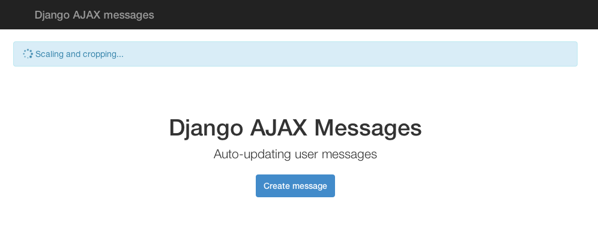
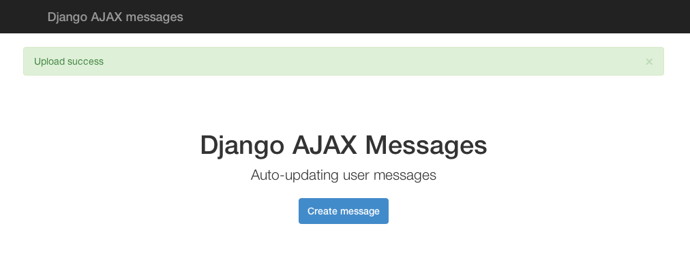

# Django AJAX Messages

**Auto-updating messages for Django.**

**Author:** Tom Christie, [Follow me on Twitter][twitter].

The `django-ajax-messages` package allows you to add auto-refreshing messages to your Django project.

This is similar to Django's `contrib.messages` application, except that once created, messages can be updated, and will automatically refresh in the browser.

**Requirements**: Django 1.5+.

---

## Screenshots

**Example messaging for an in-progress operation:**

**Example messaging for an successfully completed operation:**

---

## Testing Django AJAX messages

There is a simple test project included in this repository.  The example project can be run as follows:

    git clone git@github.com:tomchristie/django-ajax-messages.git
    cd django-ajax-messages/testproject
    virtualenv env                  # Keep everything clean by creating a fresh virtual environment.
    source env/bin/activate
    pip install -r requirements.txt # Install Django, South
    export PYTHONPATH=..            # Ensure the local copy of `ajaxmessages` is available to import.

Now create the database, **making sure to create an initial user**.

    python ./manage.py syncdb       # Make sure you create a superuser to test with.
    python ./manage.py migrate
    python ./manage.py runserver

Then, in a seperate window start the example `tick` management command that will asyncronously update the messages.

    cd testproject
    source env/bin/activate
    export PYTHONPATH=..
    python ./manage.py tick

Now open [http://127.0.0.1:8000]() in a browser window, login to the app, and click the 'Create message' button a few times.

---

## Notes

#### Messaging behaviour

* Messages that are pending will continue to display throughout subsequant page loads.
* Once a message has been displayed as succeeded or failed it will now longer be displayed on subsequant page loads.
* The AJAX updates will only take place when a page has messages displayed.  Once a user dismisses any messages on the page, or when a page is loaded without messaging, the AJAX refreshs will no longer occur.

#### Limitations

* Messages can only be issued to authenticated users.  There is no provision for messaging unauthenticated sessions.
* Message refreshing is currently hardcoded to 2 seconds.  This should probably be a setting.
* When pending messages refresh, the alert box is always reloading, even if nothing has changed.  This causes the spinner to jerk forward every so often instead of spinning smoothly. 
* Expired messages are currently never removed from the database.
* Displaying messages currently requires a database lookup.  Cache support would be nice.

---

## Installation

Install using pip:

    pip install django-ajax-messages

Add the following to your settings:

    INSTALLED_APPS = (
        ...
        'ajaxmessages',
    )

    TEMPLATE_CONTEXT_PROCESSORS = (
        ...
        'ajaxmessages.context_processors.ajaxmessages',
    )

You also need to add the messages AJAX endpoint to your URLconf:

    urlpatterns = patterns('',
        ...
        url(r'^messages/$', 'ajaxmessages.views.messages', name='ajaxmessages'),
    )

Note that the view name **must** be set to `'ajaxmessages'`.

## Creating and updating messages

Creating messages is similar to using Django `contrib.messages` framework.

    from ajaxmessages import add_message
    
    message = add_message(request.user, 'Your video is being processed...')

Once you've created a message you'll probably want to hand it over to some form of asyncronous task queue that'll run whatever ongoing job the message is associated with.

For example, using `django_rq`, you might queue a video instance and associated message using something like this:

    import django_rq
    django_rq.enqueue(run_video_processing, video=video, message=message)

Inside the task you can now update the message text:

    message.text = '...running speech recognition...'
    message.save()    

Or mark the message with a success or failure notification:

    message.status = ajaxmessages.SUCCESS
    message.save()

## Displaying messages in your templates

To include messages, add the following to any base template that
you want to display auto updating messages inside:

    

There are also a number of javascript and stylesheet requirements that you'll want to include in you base template.  The only strict external requirement is [jQuery], but you'll probably also want to include [Bootstrap] and [FontAwesome] to use the default style. 

#### Javascript requirements

You'll need to download and include [jQuery], and include in the `ajaxmessages.js` static file that's included in this package.

If you're using the default template style, and want to allow users to dismiss alerts, you'll also want to include javascript for Bootstrap.

Place the following in your base template, just before the closing `</body>` tag.

    
    
    

Download [jQuery] and [Bootstrap] and place the javascript files in your project's top level `static` folder:

     /static/js/bootstrap.js
     /static/js/jquery.js

#### Stylesheet requirements

If you're using the default template style, you'll want to include the Bootstrap CSS, as well as the fonts and styles for FontAwesome, that include the spinner icon used by the default style.

    <link href="" rel="stylesheet" media="screen">
    <link href="" rel="stylesheet">

Download [Bootstrap] and [FontAwesome] and place the stylesheets and fonts in your project's top level `static` folder:

    /static/css/bootstrap.js
    /static/css/font-awesome.css
    /static/font/FontAwesome.otf
    /static/font/fontawesome-webfont.eot
    /static/font/fontawesome-webfont.svg
    /static/font/fontawesome-webfont.ttf
    /static/font/fontawesome-webfont.woff

## Customizing the message template

You can customize how messages display by creating a template in your top level project templates directory, named `ajaxmessages/messages.html`.

You can then use styles other than the default Bootstrap styles.

## License

Copyright © Tom Christie, DabApps.

All rights reserved.

Redistribution and use in source and binary forms, with or without 
modification, are permitted provided that the following conditions are met:

Redistributions of source code must retain the above copyright notice, this 
list of conditions and the following disclaimer.
Redistributions in binary form must reproduce the above copyright notice, this 
list of conditions and the following disclaimer in the documentation and/or 
other materials provided with the distribution.
THIS SOFTWARE IS PROVIDED BY THE COPYRIGHT HOLDERS AND CONTRIBUTORS "AS IS" AND 
ANY EXPRESS OR IMPLIED WARRANTIES, INCLUDING, BUT NOT LIMITED TO, THE IMPLIED 
WARRANTIES OF MERCHANTABILITY AND FITNESS FOR A PARTICULAR PURPOSE ARE 
DISCLAIMED. IN NO EVENT SHALL THE COPYRIGHT HOLDER OR CONTRIBUTORS BE LIABLE 
FOR ANY DIRECT, INDIRECT, INCIDENTAL, SPECIAL, EXEMPLARY, OR CONSEQUENTIAL 
DAMAGES (INCLUDING, BUT NOT LIMITED TO, PROCUREMENT OF SUBSTITUTE GOODS OR 
SERVICES; LOSS OF USE, DATA, OR PROFITS; OR BUSINESS INTERRUPTION) HOWEVER 
CAUSED AND ON ANY THEORY OF LIABILITY, WHETHER IN CONTRACT, STRICT LIABILITY, 
OR TORT (INCLUDING NEGLIGENCE OR OTHERWISE) ARISING IN ANY WAY OUT OF THE USE 
OF THIS SOFTWARE, EVEN IF ADVISED OF THE POSSIBILITY OF SUCH DAMAGE.

[twitter]: http://twitter.com/_tomchristie
[jQuery]: http://jquery.com/
[Bootstrap]: http://getbootstrap.com/
[FontAwesome]: http://fortawesome.github.io/Font-Awesome/